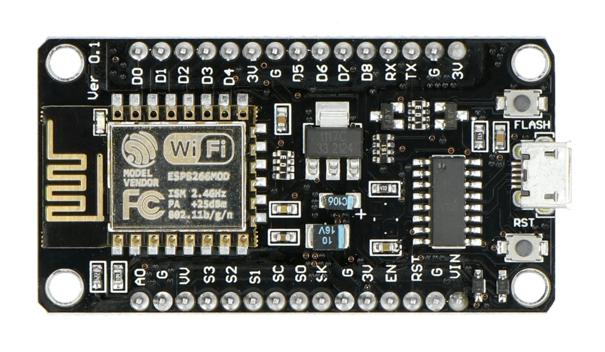
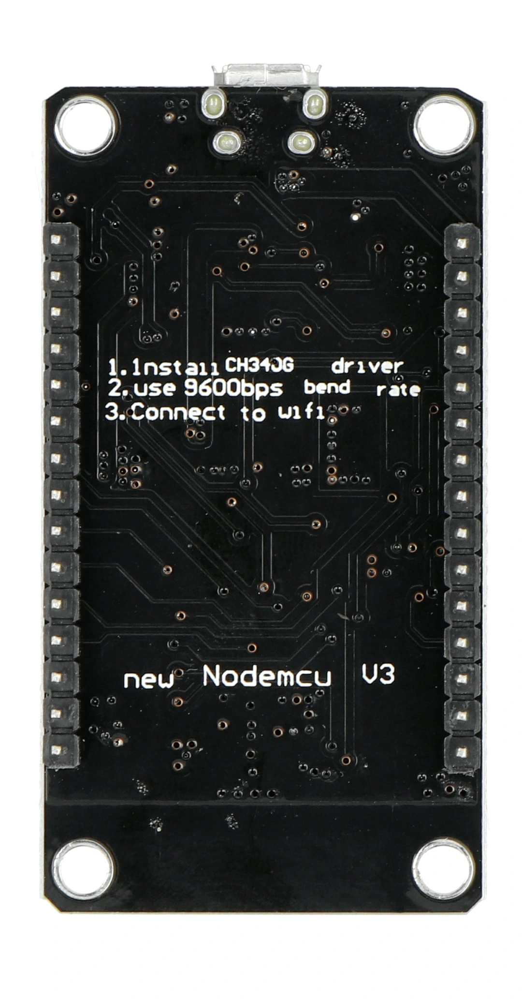
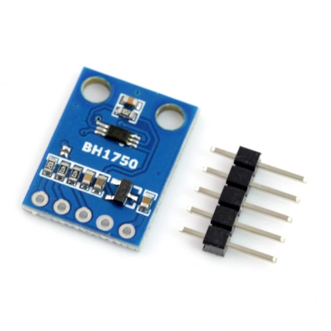
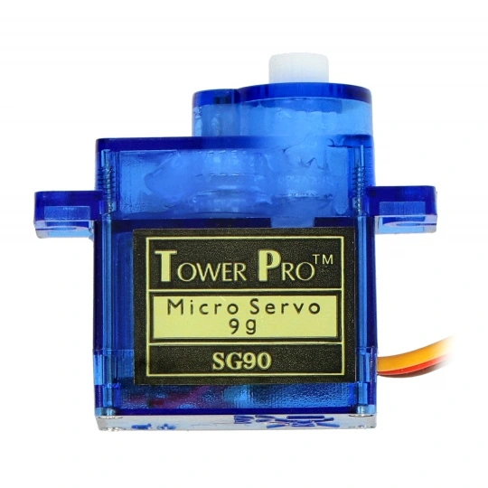
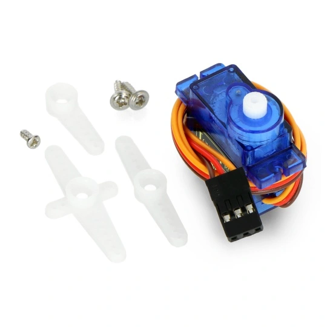
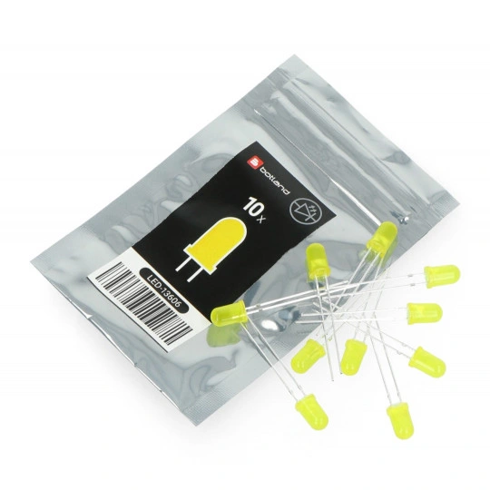
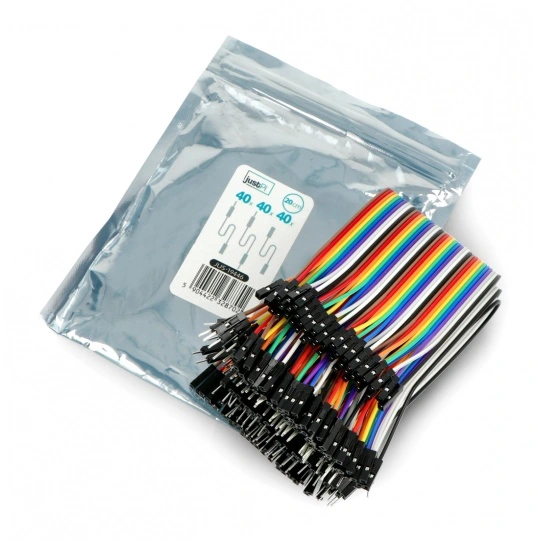
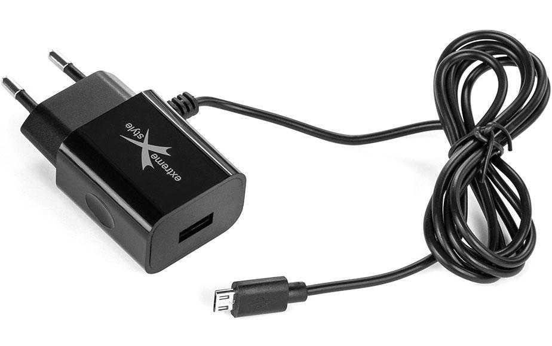
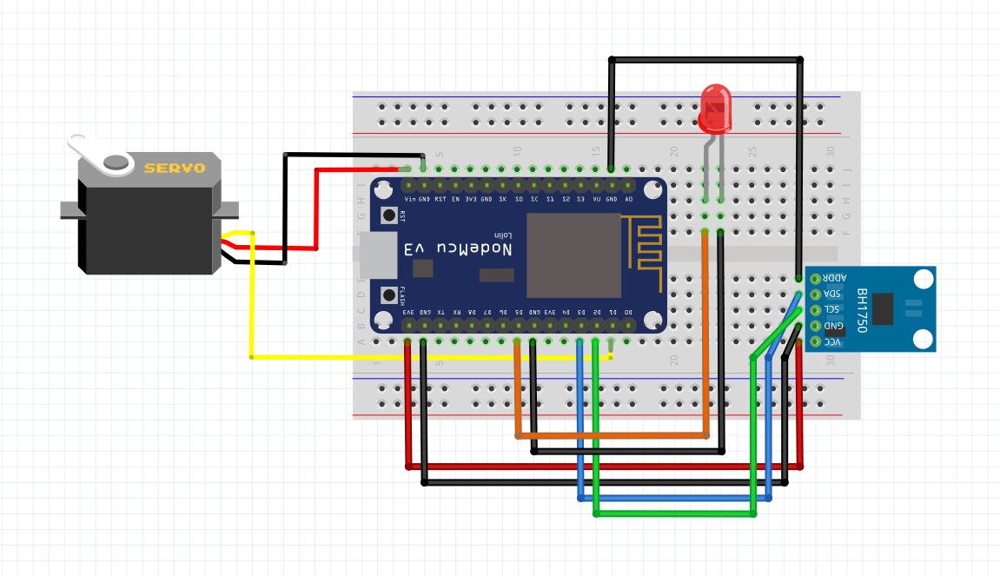

# Smart-Light-Switch-Bot (1.0 version)
This project aims to create a DIY Smart Light SwitchBot controlled via phone using wifi.

## Used Hardware
- [WiFi Module ESP8266 + NodeMCU v3](https://botland.com.pl/moduly-wifi-esp8266/8241-modul-wifi-esp8266-nodemcu-v3-5904422300630.html)

<!---->

- [Light sensor BH1750](https://botland.com.pl/czujniki-swiatla-i-koloru/2024-czujnik-natezenia-swiatla-bh1750-5904422373283.html)

- [Serwo SG-90 - micro - 180 degrees](https://botland.com.pl/serwa-typu-micro/13128-serwo-sg-90-micro-180-5904422350338.html)

<!--!-->

- [LED Diode 5mm](https://botland.com.pl/diody-led/13606-dioda-led-5mm-zolta-10szt-5903351244244.html)

- [Wires (male-to-male, female-to-female and men-to-female)](https://botland.com.pl/przewody-polaczeniowe/19946-zestaw-przewodow-polaczeniowych-justpi-20cm-3x40szt-m-m-z-z-m-z-120szt-5904422328702.html)

- Micro USB long cable + charger

## Documentation
[NodeMCU](https://nodemcu.readthedocs.io/en/release/)

[BH1750 Module](https://nodemcu.readthedocs.io/en/release/lua-modules/bh1750/)

[Servo](http://www.datasheet-pdf.com/PDF/SG90-Datasheet-TowerPro-791970)

## Breadboard

## Schematic

## Used Tools
- <a href="https://fritzing.org/">Fritzing</a>
- <a href="https://cloud.arduino.cc/">Arduino Cloud - Online Editor</a>

## YouTube presentation
<a href="https://youtube.com/shorts/5B9hfxMmvcQ?feature=share3">Click here to see video</a>

## My recommendations
In above presentation I used PowerBank insted of typical USB-C charger, mainly because of another little experiment I was conducting by the way of this project. Also, my recommendation is to buy 4 long wires to connect BH1750 and NodeMCU v3 insted of using many male-to-female wires since it causes many connecting problems during installation (I was simply too lazy :)).

## Resources and Inspiration
<a href="https://electechoz.blogspot.com/2022/01/esp8266-webserver-controller-servo-motor.html">Eleco Techoz</a>
